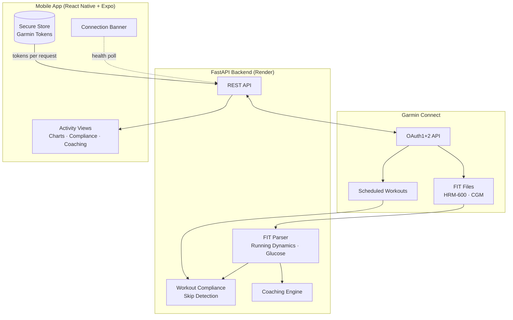

# Atlas

[](https://reactnative.dev/)
[](https://fastapi.tiangolo.com/)
[](https://render.com/)

Your intelligent running coach and athlete's toolkit. React Native mobile app with Python FastAPI backend that integrates with Garmin Connect to analyze running activities, track glucose levels, and provide training utilities.

## Overview

Atlas combines running analysis with practical training tools:

- **Running Coach** - Syncs activities from Garmin Connect, parses FIT files for running dynamics, and provides actionable coaching insights. Analyzes metrics like cadence, ground contact time, and vertical ratio to grade performance, track workout compliance, and detect fatigue patterns.
- **Glucose Tracking** - Monitor blood glucose levels for metabolic insights and fueling optimization.
- **Pace Calculator** - Calculate race paces, splits, and training zones.

## Demo

<p align="center">
  
</p>

## Features

### Running Coach

- **Garmin Connect Sync** - Securely authenticates with Garmin (MFA supported) and fetches running activities
- **Biomechanics Analysis** - Parses FIT files for running dynamics from HRM-Pro/HRM-Run sensors:
  - Cadence (steps per minute)
  - Ground Contact Time (GCT)
  - GCT Balance (left/right distribution)
  - Vertical Ratio
- **Performance Grading** - Each metric graded A/B/C/D against optimal ranges
- **Workout Compliance** - Compares completed runs against scheduled Garmin workouts with per-step breakdown
- **Skipped Step Detection** - Detects when workout steps (recovery, warmup, cooldown) were skipped using FIT lap trigger and duration analysis
- **Fatigue Analysis** - First half vs second half comparison to detect degradation
- **Heart Rate Zones** - Displays Garmin's per-activity time-in-zone breakdown
- **Coaching Insights** - Tailored feedback based on your metrics
- **Interactive Charts** - GPU-accelerated time-series charts (cadence, GCT, heart rate, glucose) with touch scrubbing
- **Connection Banner** - Animated status banner showing backend connectivity (connecting/connected/disconnected) without blocking offline features

### Glucose Tracking

- **CGM Integration** - Extracts glucose data from FIT files recorded by Garmin watches paired with a CGM (e.g., Dexcom G7)
- **Glucose Chart** - Interactive time-series chart showing glucose levels throughout the run
- **Glucose Summary** - Start, end, delta (color-coded), and min-max range displayed on the activity overview

### Toolkit

- **Pace Calculator** - Calculate target paces for races, convert between pace units, and generate split tables

## Tech Stack

### Mobile

| Tech                        | Purpose                        |
| --------------------------- | ------------------------------ |
| React Native + Expo SDK 54  | Cross-platform mobile app      |
| Expo Router                 | File-based navigation          |
| TanStack Query              | Data fetching and caching      |
| @shopify/react-native-skia  | GPU-accelerated charts         |
| expo-secure-store            | Secure token storage on device |

### Backend

| Tech                  | Purpose                        |
| --------------------- | ------------------------------ |
| Python 3.11           | Backend language               |
| FastAPI               | REST API framework             |
| fitparse              | FIT file parsing               |
| garminconnect / garth | Garmin Connect API integration |
| Docker                | Containerized deployment       |

## Architecture



**Key Design Decisions:**

- **Stateless Backend** - Tokens stored on device, passed with each request as base64-encoded tar.gz
- **Token Refresh** - Backend returns refreshed tokens via `X-Refreshed-Tokens` header
- **MFA Support** - Full OAuth1 + OAuth2 flow with MFA code handling

## Getting Started

### Prerequisites

- Node.js 18+ and npm/yarn
- Python 3.10+
- Expo CLI: `npm install -g expo-cli`
- Docker (optional, for containerized backend)
- Garmin Connect account with HRM-Pro/HRM-Run sensor

### Backend Setup

```bash
cd backend

# Create virtual environment
python -m venv venv
source venv/bin/activate  # Windows: venv\Scripts\activate

# Install dependencies
pip install -r requirements.txt

# Run locally
uvicorn app.main:app --reload --port 8000
```

### Mobile Setup

```bash
cd mobile

# Install dependencies
npm install

# API URL auto-detects: localhost in dev (expo start), Render in production (eas build)

# Start Expo
npx expo start
```

### Running with Docker

```bash
cd backend
docker build -t atlas-backend .
docker run -p 8000:8000 atlas-backend
```

## Deployment

### Backend (Render)

1. Connect GitHub repo to Render
2. Create new Web Service
3. Set root directory: `backend`
4. Docker deployment auto-detected from Dockerfile
5. No environment variables required (stateless auth)

### Mobile (EAS Build)

Builds are triggered via GitHub PR labels with EAS GitHub integration:

1. Create a PR to the `release` branch
2. Add the label `eas-build-android:preview` for APK builds
3. EAS builds automatically on label detection

Manual builds:

```bash
eas build --platform android --profile preview  # APK
eas build --platform android --profile production  # AAB for Play Store
```

## API Endpoints

| Method | Endpoint             | Description                        |
| ------ | -------------------- | ---------------------------------- |
| `GET`  | `/health`            | Health check                       |
| `POST` | `/auth/garmin/login` | Initiate Garmin login              |
| `POST` | `/auth/garmin/mfa`   | Submit MFA code                    |
| `GET`  | `/activities`        | List synced activities             |
| `POST` | `/activities/sync`   | Sync from Garmin Connect           |
| `GET`  | `/activities/{id}`   | Get activity details with analysis |

### Authentication

All `/activities` endpoints accept an optional `Authorization` header:

```
Authorization: Bearer <base64_encoded_tar_gz_of_tokens>
```

Tokens are obtained from `/auth/garmin/login` + `/auth/garmin/mfa` flow.

## Project Structure

```
atlas/
├── backend/
│   ├── app/
│   │   ├── main.py              # FastAPI app entry
│   │   ├── routers/
│   │   │   ├── auth.py          # Login/MFA endpoints
│   │   │   └── activities.py    # Activity sync/analysis
│   │   ├── services/
│   │   │   ├── garmin_sync.py   # Garmin Connect integration
│   │   │   ├── fit_parser.py    # FIT file parsing
│   │   │   └── workout_compliance.py
│   │   ├── models/              # Pydantic models
│   │   └── dependencies/        # Auth token handling
│   ├── Dockerfile
│   └── requirements.txt
│
├── mobile/
│   ├── app/                     # Expo Router pages
│   │   ├── (tabs)/              # Tab navigation
│   │   └── login.tsx            # Auth screen
│   ├── src/
│   │   ├── services/            # API client, auth service
│   │   ├── hooks/               # TanStack Query hooks, backend status
│   │   ├── contexts/            # Auth, activity contexts
│   │   ├── components/          # Charts, compliance, connection banner
│   │   └── types/               # TypeScript types
│   └── package.json
│
└── README.md
```

## Environment Variables

### Backend

No environment variables required for stateless operation. Optional for local development:

| Variable         | Description                                                     |
| ---------------- | --------------------------------------------------------------- |
| `FIT_FILES_PATH` | Path to store downloaded FIT files (default: `/data/fit-files`) |

### Mobile

API URL is auto-detected via `__DEV__` — uses localhost during Expo development and the Render URL in production builds. Configure the production URL in `src/services/apiConfig.ts`.

## License

MIT License - see [LICENSE](LICENSE) for details.
